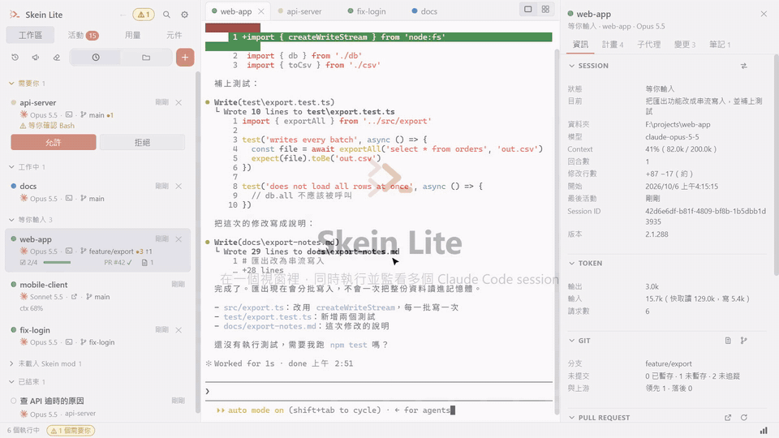

# Skein Lite

在一個視窗裡同時執行、監看多個 Claude Code session 的桌面應用程式（Windows）。

這個 repository 只放安裝檔，不含原始碼。

## 下載

到 [Releases](https://github.com/TimothySu2015/Skein-Lite/releases/latest) 下載最新的 `Skein-Lite-Setup-<版本>.exe`。

- 需要電腦上已經安裝並登入 [Claude Code](https://claude.com/claude-code)。
- 安裝檔沒有程式碼簽章，Windows 第一次執行會顯示 SmartScreen 警告。
- 安裝後會自動檢查並下載新版本，重新啟動時套用。可以在「設定」裡關閉。

## 操作手冊

[Skein Lite 操作手冊（PDF，繁體中文）](docs/Skein-Lite-Manual.pdf)：安裝、日常操作、搭配 Git 和 pull request、多帳號、自訂模型端點、設定、Codex 擴充、在 WSL 裡開 session。適用 0.16.0。

## Skein Lite 有什麼

多開 session、狀態和提醒、在 session 之間傳訊、用量、Git 整合和 pull request、變更審查。可以選用的擴充：多帳號、自訂模型端點（接地端或公司內部的模型）、Codex、在 WSL 裡的 session（Windows：用裝在 WSL 發行版裡的 Claude Code）。

---

Skein Lite runs and watches many Claude Code sessions in one window (Windows). This repository holds its installers only, not its source. Get the latest from [Releases](https://github.com/TimothySu2015/Skein-Lite/releases/latest); once installed it keeps itself up to date. The [manual](docs/Skein-Lite-Manual.pdf) is in Traditional Chinese.

Copyright © 2026 Timothy Su. All rights reserved.